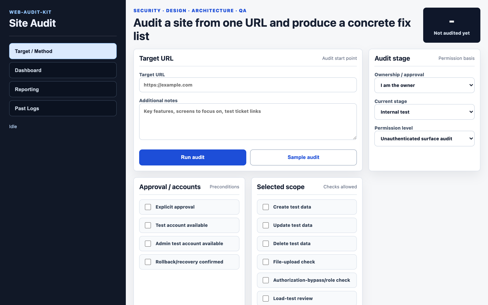

# web-audit-kit

[](https://github.com/oh-namgyu/web-audit-kit/actions/workflows/ci.yml)
[](LICENSE)
[](https://github.com/oh-namgyu/web-audit-kit/releases)


> **한글 요약** — 설치형 사이트 감사 리포터입니다 — 대상 사이트를 건드리지 않는 비침습 방식으로 보안·UX·아키텍처·기능 QA를 한 번에 점검해 리포트를 만듭니다. *(전체 한국어 문서: [README_KOR.md](README_KOR.md))*

**[🇰🇷 한국어 README](README_KOR.md)**

Non-invasive site audit reporter for security, UX/design, architecture, and functional QA.



web-audit-kit is designed as a local-first audit assistant. It opens a target URL, collects passive browser/header evidence, creates Markdown/HTML/JSON reports, and can optionally send those reports by email.

## Safety Notice

Only audit systems you own or have explicit permission to test.

By default this server binds to `127.0.0.1` and mail delivery is disabled. Do not expose it to the public internet without adding your own authentication, target allowlist, rate limits, and network controls. The app accepts a target URL and visits it with `fetch` and Playwright, so an exposed instance can be abused as an internal-network scanning or SSRF tool.

Generated reports and screenshots can contain target URLs, page text, recipient emails, and local file paths. They are ignored by git and should not be committed.

## Requirements

- Node.js 20 or newer
- Playwright

## Quick Start

Clone the repository:

```bash
git clone https://github.com/oh-namgyu/web-audit-kit.git
cd web-audit-kit
```

Install dependencies:

```bash
npm install
```

Install browser binaries if your Playwright setup needs them:

```bash
npx playwright install chromium
```

## Run

```bash
npm start
```

Open:

```text
http://127.0.0.1:6197
```

## Basic Usage

1. Open `http://127.0.0.1:6197`.
2. Enter a target URL you own or are authorized to test.
3. Select the audit context:
   - ownership
   - environment
   - permission level
   - approval/scope options
4. Click `Run audit`.
5. Review the result in the dashboard and reporting tabs.
6. Export the report as HTML, Markdown, or JSON.

Generated files are saved locally:

```text
data/reports/<id>.json
data/reports/<id>.md
data/reports/<id>.html
data/screenshots/<id>-desktop.png
data/screenshots/<id>-mobile.png
```

These files are ignored by git because they may contain target URLs, page text, email recipients, and local evidence paths.

## What It Checks

- Security headers and cookie flags
- HTTPS/HSTS/CSP/frame protections
- Desktop and mobile rendering
- Console errors and failed requests
- Basic accessibility and UX signals
- Layout overflow and tap-target issues
- Form, button, link, image, and heading structure
- Functional QA signals such as duplicate IDs and missing states
- Audit scope risks from the selected test profile

## Environment

Copy `.env.example` to `.env` if you want to customize local behavior.

Important defaults:

- `HOST=127.0.0.1`
- `PORT=6197`
- `TESTGPT7_MAIL_TRANSPORT=disabled`

To bind outside loopback, you must explicitly set:

```bash
TESTGPT7_ALLOW_NETWORK_EXPOSURE=true
```

Use this only on a trusted network with separate access controls.

When the server is bound outside loopback, target URLs are blocked unless an allowlist is set:

```bash
TESTGPT7_TARGET_ALLOWLIST=example.com,*.example.org
```

To intentionally allow any target behind your own access controls:

```bash
TESTGPT7_ALLOW_ANY_TARGET=true
```

When exposed to a network, private/reserved IP ranges are blocked after DNS resolution by default. This also applies to redirects and Playwright subresources. Local loopback mode keeps private targets available for internal development unless you opt in:

```bash
TESTGPT7_BLOCK_PRIVATE_IPS=true
```

To allow private targets in a network-exposed deployment, you must explicitly set:

```bash
TESTGPT7_ALLOW_PRIVATE_TARGETS=true
```

Use that only for a tightly controlled internal deployment.

## Mail Delivery

Mail is opt-in.

Supported transports:

- `disabled`
- `sendmail`
- `smtp`

SMTP example:

```bash
TESTGPT7_MAIL_TRANSPORT=smtp
TESTGPT7_MAIL_FROM=audit@example.com
TESTGPT7_SMTP_HOST=smtp.example.com
TESTGPT7_SMTP_PORT=587
TESTGPT7_SMTP_SECURE=false
TESTGPT7_SMTP_USER=example-user
TESTGPT7_SMTP_PASS=replace-with-app-password
```

> Note: the environment variables keep the `TESTGPT7_` prefix as a stable configuration contract; only the project name changed to web-audit-kit.

## API

Health:

```bash
curl http://127.0.0.1:6197/api/health
```

Run an audit:

```bash
curl -X POST http://127.0.0.1:6197/api/audit \
  -H 'Content-Type: application/json' \
  -d '{
    "targetUrl": "https://example.com",
    "profile": {
      "ownership": "owner",
      "environment": "internal-test",
      "permissionLevel": "surface-only",
      "hasExplicitApproval": true,
      "reportRecipients": ""
    }
  }'
```

List reports:

```bash
curl http://127.0.0.1:6197/api/reports
```

Export a report:

```bash
curl 'http://127.0.0.1:6197/api/export?id=REPORT_ID&format=html'
```

## Public Release Checklist

- Keep generated `data/reports/*` and `data/screenshots/*` out of git.
- Keep `.env` and credentials out of git.
- Keep the default loopback binding unless you have external access controls.
- Keep mail delivery disabled unless explicitly configured.
- Add authentication, target allowlists, and rate limits before shared hosting.
- Keep private IP blocking enabled for any network-exposed deployment.
